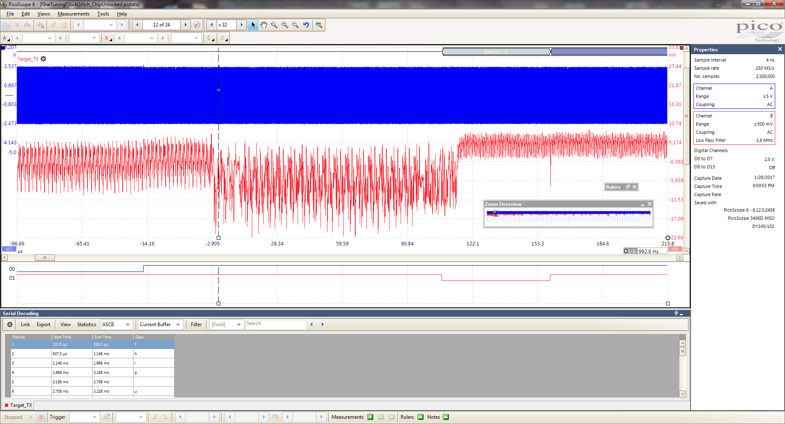
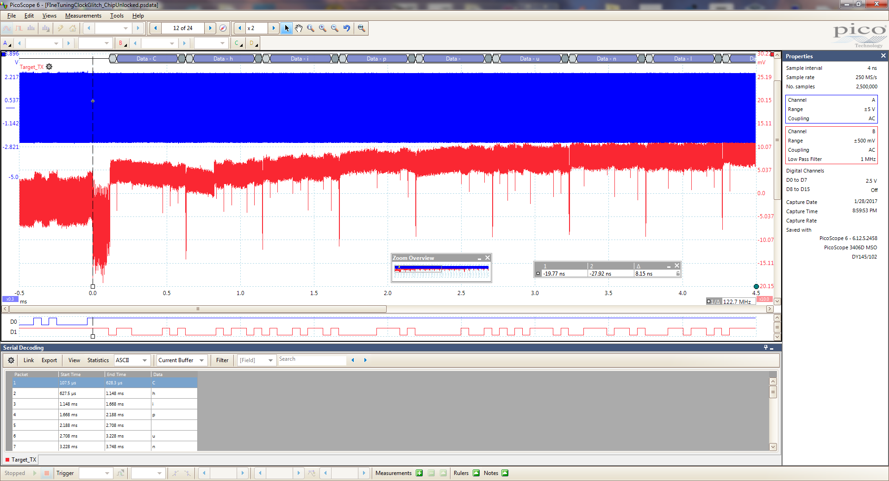

# rhme-2016 write-up Finetuning

<a name="finetuning"></a>
## Finetuning (Fault Injection - 200 pts)

This challenge display
```
RHME2 FI level 2.

Chip locked
Please write your password:
```
Each time you enter a password+LF it says Chip Locked

A good start was to read https://wiki.newae.com/Tutorial_A2_Introduction_to_Glitch_Attacks_(including_Glitch_Explorer)

We have used HydraRHME2 with Chipwhisperer with following configuration: 

```
Target Settings => HydraRHME2
Init Command Empty
Load Key Command Empty
Load Input Command Empty
Go Command 0A
Output Format $GLITCH$
baud 19200

Scope Settings => CW Extra => CW Extra Settings => Trigger Pins
Target IO1 (Serial TXD) Only other not checked
Target HS IO-Out Glitch Module

Scope Settings => Glitch Module
Clock Source CLKGEN
Glitch Width (as % of period) 30
Glitch Width (fine adjust) 0
Glitch Offset (as % of period) 39
Glitch Offset (fine adjust) 0
Glitch Trigger Ext Trigger:Single-Shot
Single-Shot Arm After Scope Arm
Trigger Offset 15580
Repeat 10
```
After lot of tries(to find the right Trigger Offset) with the help of the Picoscope the Chip is Unlocked with the flag:
`Chip unlocked\r\nFLAG: 680a02311032b4e9c87ddf1ece7118de`




