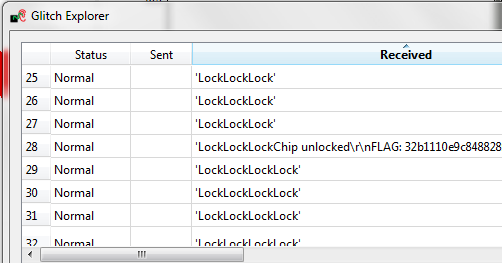

# rhme-2016 write-up Fiesta

<a name="fiesta"></a>
## Fiesta (Fault Injection - 100 pts)

After loading the Fiesta challenge the rhme2 board(uart@19200bauds8N1) immediately output in loop "Lock"
The aim of this challenge is to glitch the Clock or the VCC to exit this loop(skip jump instruction) and output the flag.

A very easy way to do this FI it is to plug HydraRHME2 with Chipwhisperer and configure Chipwhisperer Clock Out to 16MHz then power on the rhme2 board and just diconnect/reconnect the clock and by magic the flag appear ...

The real FI is to configure CWCapture with following parameters:
```
Scope Settings => Trigger Pins
Target IOI2 (Serial RXD)

Scope Settings => Glitch module
Clock Source CLKGEN
Glitch Width (as % of period) 20
Glitch Offset (as % of period) 30
Ext Trigger Offset 50000
Repeat 10

Glitch Explorer Window
Tuning Parameters 1
s.startswith("Lock")
s.find("FLAG")!=-1

Tuning Parameters 0
Param #0
['Glitch Module', 'Glitch Offset (as % of period)']
Float
Range -49, 30
Step 1
Repeat 1
```


