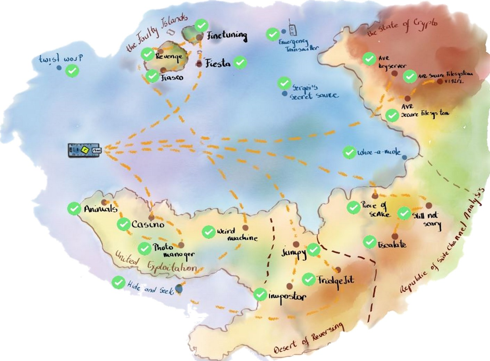

# rhme-2016 write-up Team HydraBus

## Introduction

HydraBus team for this challenge has been made up of:
+ bvernoux
+ chrisrdlg
+ FdLSifu
+ kag

We joined the challenge mid-december which was late compared to other participants but we enjoyed every bits of [rhme2](http://rhme.riscure.com/challenges).

We are not used to CTFs but rhme2 and rhme has the particularity of proposing a wide range of challenges and we wanted to learn while having fun.
For that, we thank rhme2 organization team for challenges quality!!!

The initial objective was to be part of TOP 10. As time goes by and challenges solved, we realized we were really into it.
Solving challenges as a team is really fun, ideas are popping up, wrong paths are investigated and then the light shines up!

You will find write ups written by the team member and hope you feel all the fun we got resolving ALL challenges (bootloader what??!)

RHme2 official GitHub with all challenges(bin/src) is available here: https://github.com/Riscure/Rhme-2016

## Table of contents
 * [Reverse](Reverse)
   * [Jumpy](Reverse/Jumpy.md)
   * [The Impostor](Reverse/TheImpostor.md)
   * [FridgeJIT](Reverse/FridgeJIT.md)
 * [Exploit](Exploit)
   * [Photo Manager](Exploit/PhotoManager.md)
   * [Animals](Exploit/Animals.md)
   * [Casino](Exploit/Casino.md)
   * [Weird Machine](Exploit/WeirdMachine.md)
 * [Crypto](Crypto)
   * [Key Server](Crypto/KeyServer.md)
   * [Secure Filesystem](Crypto/SecureFilesystem.md)
   * [Secure Filesystem v1.92r1](Crypto/SecureFilesystemV1_92r1.md)
 * [Fault Injection](FaultInjection)
   * [Fiesta](FaultInjection/Fiesta.md)
   * [Finetuning](FaultInjection/Finetuning.md)
   * [Fiasco](FaultInjection/Fiasco.md)
   * [Revenge](FaultInjection/Revenge.md)
 * [Side Channel Analysis](SideChannelAnalysis)
   * [Hardware modification](SideChannelAnalysis/HardwareMod.md)
   * [Piece of Scake](SideChannelAnalysis/PieceofSCAke.md)
   * [Still Not Scary](SideChannelAnalysis/StillNotScary.md)
   * [Escalate](SideChannelAnalysis/Escalate.md)
 * [Other](Other)
   * [Twist Word](Other/Twistword.md)
   * [Emergency Transmitter](Other/EmergencyTransmitter.md)
   * [Secret Sauce](Other/SecretSauce.md)
   * [Whack The mole](Other/WhackTheMole.md)
   * [Hide & Seek](Other/HideAndSeek.md)

