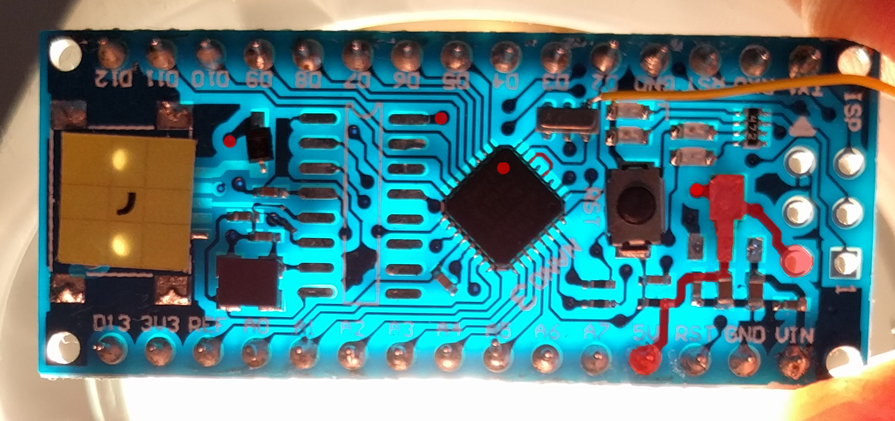
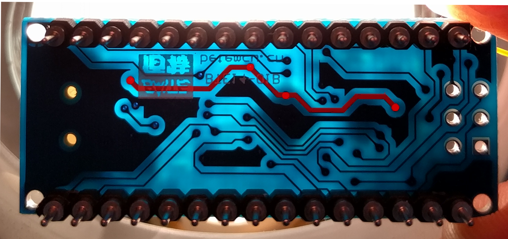
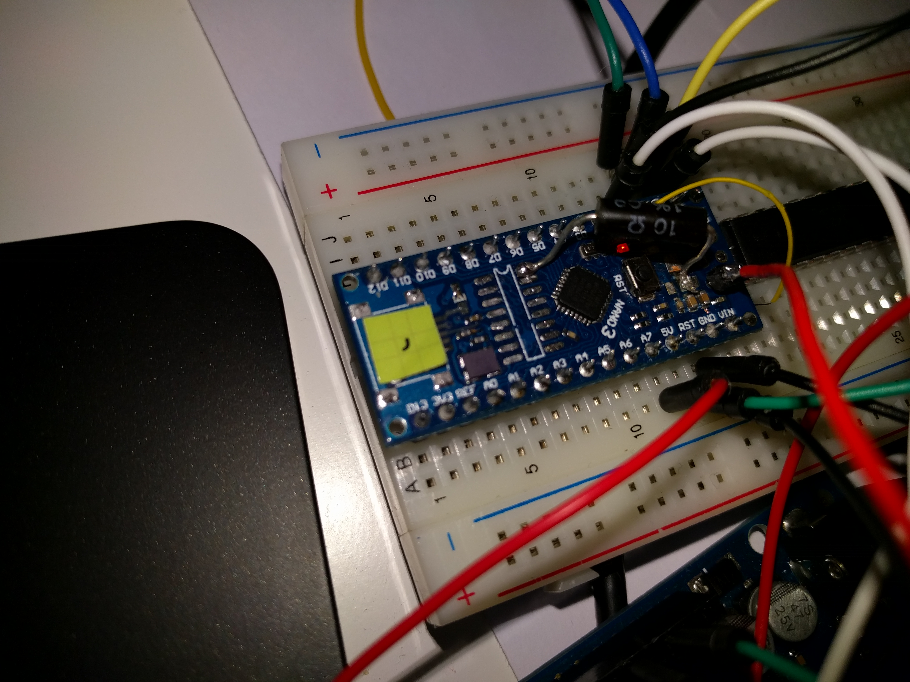
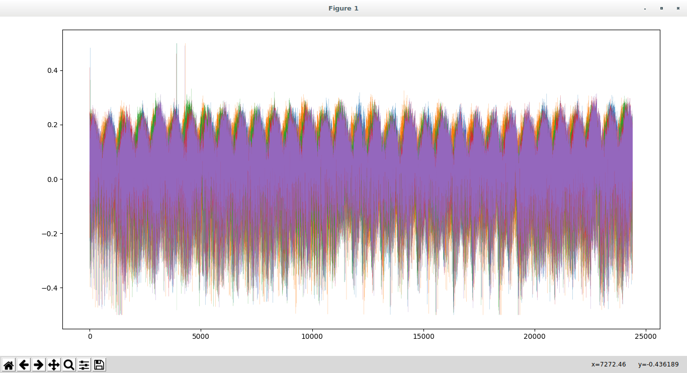
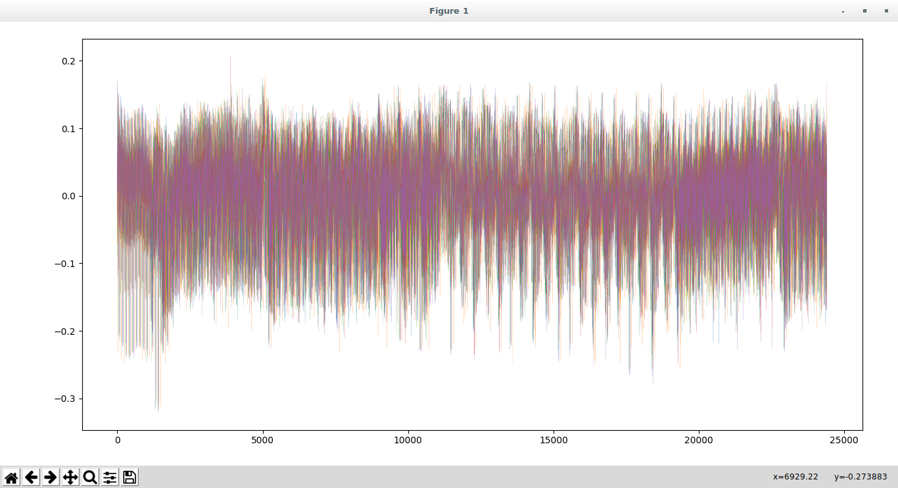

To collect side-channel information, you will typically want to measure the power consumption of the ATMega by [adding a resistor as close as possible](https://wiki.newae.com/CW308T-GENERIC#Riscure_CTF_Board) to the chip.

If you are lucky enough to be on the HydraBus team, then you can even [design your own board and transfer the chip to it](PieceofSCAke.md). Otherwise, here is another way to proceed.

We had boards from one of the latest batch, which were single-sided and with the ATMega in a really tiny QFN package. Adding the resistor on the 328P pin was out of reach for my soldering skills and hardware, so I tried to find another way. I had fried lots of parts already on the board (USB connector, diode) which pushed me to make more room and get rid of other, still active but useless, elements (5V regulator, USB/serial converter) which would just add extra power consumption.

I needed a lot of space to solder the resistor I had. For that, I analyzed how the 5V was distributed on the board, trying to find the most appropriate location for both physical and electrical constraints. The red dots show via positions, most of the 5V rail is highlighted in red.



As you can see, this side is empty.



In the end, I decided to cut the pad which used to host the 5V regulator to have the resistor be located after the decoupling capacitors on the 5V rail and just before the 328P, and be able to monitor the voltage at the chip pin spot with a ChipWhisperer by using one of the ISP connector pins.




After that, I obtained an encouraging result.



We can improve the curve shape by applying a Butterworth filter.

```python
from scipy import signal

data = np.load("2017.02.27-21.41.52_traces.npy")
b, a = signal.butter(2, 0.3, 'low')

for d_i, d in enumerate(data):
    data[d_i] = signal.filtfilt(b, a, d)
```



We can clearly see different steps of the algorithm on the filtered data, which we can then try to identify, synchronize and finally attack with DPA or CPA for example.