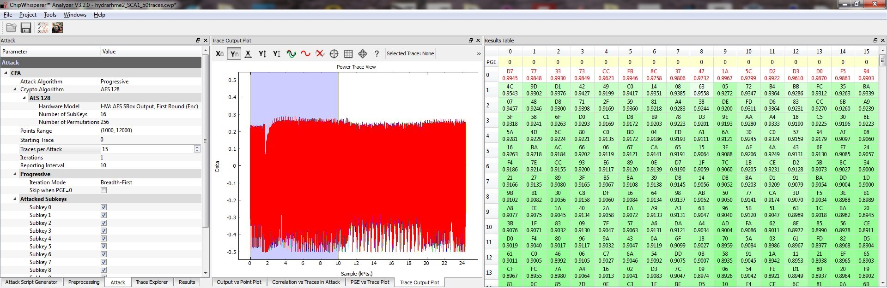

# rhme-2016 write-up Piece Of SCAke

## Piece Of SCAke (Side Channel Analysis - 100 pts)

After several tries in acquering power traces from different point. We decided 
to develop our own PCB hosting the Riscure ATMega328p. It has been widely 
inspired from Colin O'Flynn board. It is natural as we wanted to plug it to a 
chipwhisperer lite. 

Here is the setup:

A front view

A back view

With this setup we do had clean curves and Piece Of SCAke 
has been a real piece of scake. We have collected 50 traces with random inputs.
Using numpy, we computed the correlation on these inputs and found a strong 
correlation which validated our setup. The leakage is here and the micro 
controller leaks a lot. The next and final step was to perform key byte guess 
attacking the ouput of AES Sbox for each byte. A strong correlation between 
hamming weight of AES Sbox output and traces validate the key byte guess. 
All key bytes can be retrieved as follow and the flag is the key itself.

Just for fun/challenge with our clean traces we can recover the AES key with only 15 traces

[Chipwhisperer](https://github.com/newaetech/chipwhisperer) CWAnalyzer data compressed:
[PieceofSCAke_CWAnalyzer_50traces_data.7z](PieceofSCAke_CWAnalyzer_50traces_data.7z)
